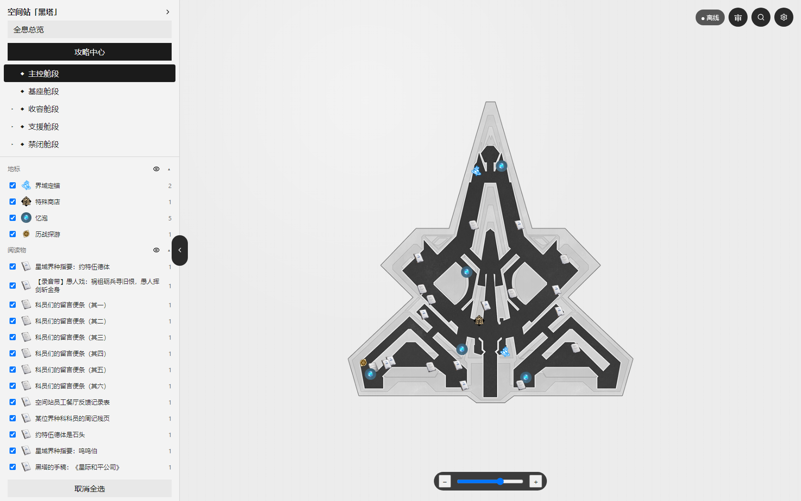
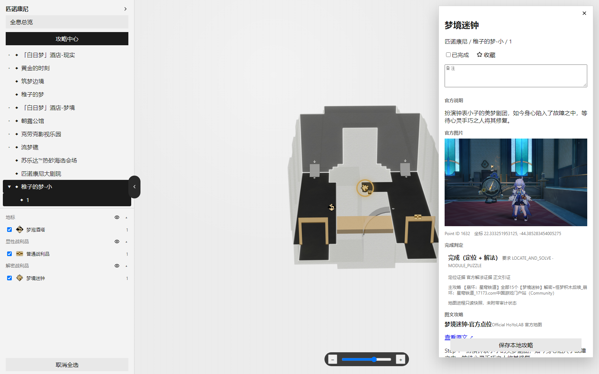
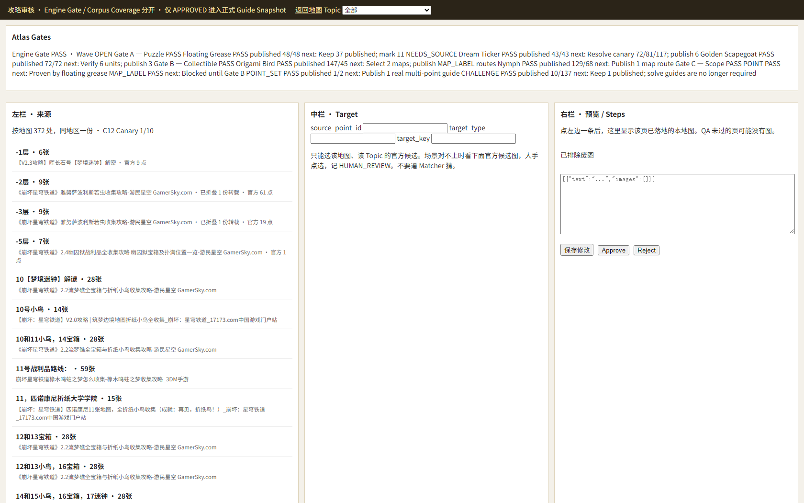
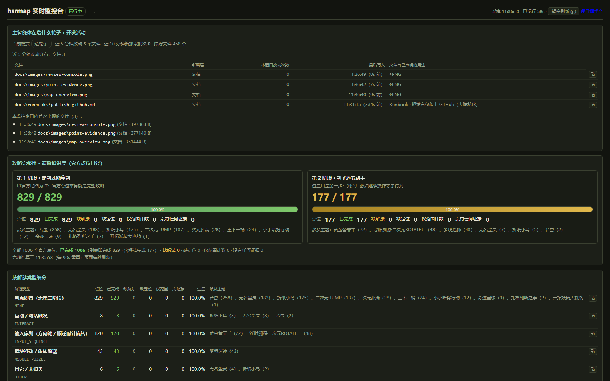

# hsrmap · Guide Atlas

[](https://github.com/sdsdsssssdsd/hsrmap/actions/workflows/ci.yml)


An offline **interactive map + guide evidence engine** for *Honkai: Star Rail*: it turns the official
interactive map and community guides into a corpus that can answer one question per collectible —

> **"If I follow the material we have, can I actually get this?"**

If yes, the point is *complete*. If not, the engine says precisely what is missing — the **location**
or the **solution** — and turns the gap into the next search queue. Every verdict has to show its work:
source page, verbatim fragment, image transcription, or an explicit inference basis.

Current state on the reference snapshot: **1006 / 1006 official points reachable**
(829 "walk there and take it" + 177 requiring a solution), `closure-check` 10/10 PASS,
and both `HALLUCINATED_STEP` and `UNGROUNDED_STEP` audits sit at **0**.

---

## Screenshots

**Offline map** — the official map, its labels, and your own progress, fully offline:



**Point detail: *why* a point counts as complete** — completion requirement, location/solution evidence
levels, the winning guide, audit status, and per-step evidence badges (official / community text /
image transcription / cross inference):



**Review console** — engine gates, the source queue grouped by map, target binding and preview:



**Live monitor** — read-only process, file, database and judgement-layer telemetry:



---

## Quick start

```bash
python -m pip install -r requirements.lock.txt      # or: pip install -e ".[dev]"

python -m hsrmap runtime                            # which runtime directory is in use, and why
python -m hsrmap doctor                             # closed-loop self check (entry points, ports, first paint)
python -m hsrmap guides completeness --markdown     # completion table across every topic
python -m hsrmap guides closure-check               # 10-item acceptance scoreboard (PASS/FAIL)
python -m hsrmap repo-hygiene                       # repository hygiene (fails only on *new* violations)
python -m hsrmap dod                                # Definition of Done: 12 machine-checked items
python -m pytest -q                                 # full suite (no real data/ required)
```

Two local services — the review console and the offline map are **separate processes on separate ports**
and do not depend on each other:

```bat
start.bat          :: offline map    http://127.0.0.1:8766/
start_review.bat   :: review console http://127.0.0.1:8767/review
```

The map process only needs the snapshot (`current.json`, `snapshots/*/core.db`) and `web/dist`;
the review process only needs `guide.db` / `published.db`. Both read the same `user.db` for your marks.
A third read-only tool, `monitor/start_monitor.bat`, serves live telemetry on port **8768**.

---

## How the judgement works

No percentages, no model in the decision path — a point falls into exactly one of six states:

| Dimension | Values |
| --- | --- |
| Completion requirement | `LOCATE_ONLY` (walk there and take it) · `LOCATE_AND_SOLVE` (you must do something) |
| Evidence ability | `SCOPE` (how many exist) · `LOCATE` (can I find it) · `SOLVE` (what to do there) |
| State | `NO_EVIDENCE` · `SCOPE_ONLY` · `LOCATE_MISSING` · `LOCATE_COMPLETE` · `SOLVE_MISSING` · `COMPLETE` |

Phase 1 treats the official map as authoritative: a point existing on it *is* location evidence.
Phase 2 requires a real solution — a direction sequence, a module order, an interaction — supplied by
community text or by an image transcription.

Each claim carries its own provenance, so a corpus-wide "1006 / 1006" can never hide how it was reached:

| Evidence level | Meaning |
| --- | --- |
| `OFFICIAL` | the official map/point line itself |
| `COMMUNITY_TEXT` | verbatim/fragment/assembled grounding in a crawled page |
| `TRANSCRIPTION` | read off an image that is attached to that very entry (`[图解法转录 <sha>]`) |
| `CROSS_INFERENCE` | inferred, and therefore **must** carry a machine-readable basis |

Aggregated as `direct` / `transcription` / `inference` / `missing`, and shown in the UI.

---

## Personal progress layer (Phase 6)

Everything above is credentials-free. Phase 6 adds an **opt-in, read-only** view of *your own*
official-map progress — while keeping the meanings of "done" strictly apart:

| Semantic | Meaning | May derive local `completed`? |
| --- | --- | --- |
| `manual` | you ticked the point in this app | **yes**, always |
| `game_obtained` | proven looted in game | only after the Gate 0 experiment |
| `map_mark` | marked on the official interactive map | **no** by default — display only |
| `unknown` | the source cannot say | **never** |

The single switch lives in `hsrmap/progress/models.py` (`VERIFIED_SEMANTICS`, currently empty), so
"we do not know" can never quietly become "you already have it". Remote observations land in
`progress_profile` / `progress_observation` (user.db schema v2) and never change the semantics of
`point_progress`.

```bash
python -m hsrmap progress endpoints          # 20 contracted endpoints; mutating ones are refused by the framework
python -m hsrmap progress probe --realm cn   # read-only semantic probe; credential comes from the environment
python -m hsrmap progress status             # observation store + local_only / remote_only / both / unknown
python -m hsrmap progress merge --semantics map_mark            # dry-run: prints the plan, writes nothing
python -m hsrmap progress merge --semantics map_mark --confirm  # writes completed = 1 only
python -m hsrmap progress remaining          # Remaining Atlas: collectible − effective completed
python -m hsrmap progress routes             # region clustering + nearest-neighbour ordering
```

Credential discipline: one entry point (the environment variable), held opaquely in memory —
redacted `repr`, unpicklable, never in logs, reports or exceptions. Merging is dry-run by default
and can only ever set `completed = 1`; the viewer serves progress through read-only endpoints and
reports `viewer_network: 0`. Runbook: [`docs/runbooks/progress-p6.md`](docs/runbooks/progress-p6.md).

---

## Architecture

```text
official interactive map ──sync──▶ snapshot (core.db / detail.db)        [runtime dir]
                                      │
                                      ├── official-seed ──▶ official point entries (LOCATE evidence)
community guide pages ──fetch/parse/import──▶ guide.db (pages / entries / steps / assets / review)
                                      │
                                      ├── audit    (grounding: EXACT / FRAGMENT / ASSEMBLED / image transcription)
                                      ├── stages   (requirement × evidence → six states, no model involved)
                                      ├── ledger   (every search, candidate and rejection reason)
                                      ▼
                     publish-snapshot (diff → hard/review gate → staging → audit + offline E2E
                                      → manifest → atomic switch)
                                      ▼
                     published.db (immutable snapshot) ──▶ review console / offline map / reports
```

Key modules (all under `hsrmap/`):

| Module | Responsibility |
| --- | --- |
| `guides/stages.py` | completion model: requirement × evidence → six states |
| `guides/audit.py` | "is this step really in its source?" — four grounding tiers plus the transcription channel |
| `guides/claims.py` | evidence claims: level, grounding tier, asset, inference basis, digest |
| `guides/evidence.py` | search ledger: run / result / verdict (including `NO_PUBLIC_SOURCE_FOUND`) |
| `guides/publishing/` | diff, gates, staging, atomic switch, offline E2E, snapshot manifest |
| `guides/closure.py` | the 10-item closure scoreboard |
| `progress/` | read-only official-map progress: contracts, credential boundary, semantic probe, observation store, diff, Remaining Atlas, route planner |
| `runtime.py`, `paths.py` | runtime directory resolution and lazy runtime paths |
| `hygiene.py`, `release.py` | repository hygiene rules, allowlist-based release packaging |
| `dod.py`, `doctor.py` | Definition-of-Done gate and the closed-loop self check |

---

## Runtime directories

A Git checkout is **not** a mutable state root. Resolution order (first hit wins):

```text
--data-dir  →  HSRMAP_DATA_DIR  →  <repo>/data (compat window)  →  OS user data directory
```

* `python -m hsrmap runtime` prints the chosen directory and its source (`explicit`/`env`/`repo`/`user`);
* read-only commands never create a database — a missing DB is `rc=1` with a reason, not an empty file;
* database opening is explicit: `open_readonly` / `open_readwrite` / `create`; only `create` may
  create directories, tables or migrations;
* tests point the runtime directory at a temp dir, so `pytest` never touches your `data/`;
  cases that need the real snapshot are marked and run with `--run-data-e2e`.

---

## Testing & gates

| Command | What it proves |
| --- | --- |
| `pytest -q` | unit + integration, no real data needed (~700 tests) |
| `pytest --run-data-e2e` | snapshot/detail/guide-backed cases, including the six-state shadow comparison |
| `ruff check hsrmap tests tools` | lint |
| `hsrmap repo-hygiene` | no new runtime/build/secret pollution (baseline: `tools/hygiene_baseline.json`) |
| `hsrmap guides published-audit` | grounding audit of everything published |
| `hsrmap guides closure-check` | the acceptance scoreboard (exit code 0 PASS / 2 FAIL) |
| `hsrmap dod` | Definition of Done: 12 machine-checked items |
| `hsrmap doctor` | closed-loop check: entry points, ports, first-paint requests and payload budgets |

**Command contract:** `0` = success (including an explicit NOOP), `1` = execution/environment/data error,
`2` = usage error or a gate refusal. Only an explicit `--quiet` may print nothing.

The hard invariant behind all of this: the six-state matrix must be **bit-identical** to the frozen
baseline (`docs/runbooks/baseline-hygiene.json`) — evidence levels are annotations, never a second
source of truth. The shadow test verifies this per point, for every lookup implementation.

---

## Release packaging

```bash
python -m hsrmap release --dry-run     # list what would ship
python -m hsrmap release               # build submit/ + submit.zip + release-manifest.json
python tools/privacy_scan.py submit    # privacy scan before publishing
```

The allowlist is the source tree minus the hygiene-forbidden set (runtime `data/`, the `submit/`
mirror, generated reports, runtime SQLite, caches, secrets, backups, oversized artifacts), with a
single exception: `web/dist` ships so that a clone runs immediately. The zip digest is written to a
sibling `.sha256` file; `release-manifest.json` lists every shipped file, and `hsrmap dod` item 6
verifies that the directory and the manifest agree exactly.

---

## Repository layout

```text
hsrmap/            application code (judgement, corpus, publishing, services)
hsrmap_phase1/     phase-1 capture/calibration package (reference implementation)
phase1/            immutable reference data: endpoint_registry, calibration, samples
tests/             tests (small, human-checkable fixtures)
web/src/           front-end source (dist is a build product, shipped by release)
docs/              specs, runbooks, architecture notes, staging records
tools/             developer tools (release, hygiene, privacy scan, crawlers)
data/ submit/ artifacts/ logs/ reports/   ← runtime & build products, never in the source tree
```

---

## Evidence discipline

* **Official first.** Phase 1 accepts only the official map; there is no "wait for official to add more".
* **Traceable sources.** Every step is either found verbatim (or in fragments) in the page it claims,
  or explicitly marked as transcribed from an image attached to that entry.
* **Inference leaves a trace.** Cross inference must record its basis, and summaries state the boundary.
  `HALLUCINATED_STEP` is a hard publish failure.
* **A negative result is a result.** `source_search_run/result/verdict` records every attempt and refusal.
* **Nothing silent.** Commands print or exit non-zero; read-only operations never create databases;
  tests never write into the repository.

---

## Contributing

Issues and pull requests are welcome. Before opening a PR:

1. judgement or publishing semantics → write a shadow comparison first (old vs new, all six states must
   match point by point);
2. new data operations → use the official entry points (`hsrmap guides …`, `hsrmap release`,
   `hsrmap repo-hygiene`) instead of adding one-off scripts;
3. before committing: `pytest -q` + `ruff check` + `repo-hygiene` + `hsrmap dod` all green;
4. before releasing: rebuild with `hsrmap release` and check `release-manifest.json`.

Design documents under `docs/` are written in Chinese; code comments follow the same convention,
while this README and the CLI output stay in English.

---

## License & content notice

Code is released under the [MIT License](LICENSE).

This repository ships **no game data and no crawled content**: `data/`, databases, downloaded
images and generated reports are excluded by design, and the snapshot must be built locally with your
own credentials-free access to the official map. Guide texts, screenshots and trademarks referenced by
the tooling belong to their respective authors and rights holders (HoYoverse / miHoYo and the original
guide authors); the MIT license covers this project's source code only.
